# 🛸 GLOW LOGIC : CAHIER DES CHARGES & SPÉCIFICATIONS TECHNIQUES
*Cahier des charges pour l'implémentation d'une régie multimédia temps réel unifiée.*

---

## 🎯 1. Vision, Objectifs & Limites du MVP

### Vision Globale
Unifier le contrôle scénique (DMX/LED, vidéo-mapping, lasers, drones, pyrotechnie) sous une interface unique réactive au rythme et assistée par IA.

### Limites du MVP (Périmètre du projet)
1. **Physique & Réel (MVP 1)** : Éclairage DMX, Art-Net/USB, Grille de clips (VJ) et Timeline de base.
2. **Simulé (MVP 2)** : Les lasers, drones, et feux d'artifice restent exclusivement en **mode simulation** dans le visualiseur 3D. Aucun signal physique n'est émis pour ces sorties tant que la couche de sécurité déterministe n'est pas validée.

---

## 📊 2. Refactoring & Harmonisation de l'Interface

### A. Vocabulaire Unique & Harmonisé
* **`SmartDashboard`** : La console de régie principale unique en direct (Live). Elle fusionne les anciens modules distincts (`LivePerformanceView`, `WidgetPanel`).
* **`PatchPanel`** : L'interface de configuration 2D du plan de feu.
* **`MacroTimeline`** : Le séquenceur linéaire (Arrangement) en bas d'écran.
* **`SettingsModal`** : Les réglages généraux (MIDI, LLM, DMX).

### B. Suppression Réelle & Intégration
* Les composants isolés `ChaserEditor.tsx`, `CueList.tsx` et `SceneBuilder.tsx` sont définitivement supprimés.
* **Intégration** :
  * Les Cues (Scènes statiques) sont gérées sous forme de clips sur la `MacroTimeline`.
  * Les Chasers (Chenillards) sont édités sous forme de pistes de modulation rythmique dans la timeline.

---

## 🛡️ 3. Moteur de Sécurité & Validation Déterministe (Safety Gate)

Toute commande générée par l'IA ou reçue par une API externe (comme MAVLink, ILDA, Pyro) passe obligatoirement par un **filtre de validation déterministe** (Safety Gate) écrit en code dur non-IA.

```
 [Suggestion IA] ──► [Filtre de Sécurité Déterministe] ──► [Validation / Armement Manuel] ──► [Sortie DMX/Physique]
                     - Limites physiques codées en dur
                     - Zones de vol geofencées
                     - Blocage de puissance max
```

### Règles de Verrous Physiques :
1. **Armement Manuel Obligatoire** : Les effets de pyrotechnie et de lasers possèdent un statut `DISARMED` par défaut. L'IA ne peut pas les armer. L'utilisateur doit cliquer manuellement sur un bouton d'armement physique de l'interface ou de son contrôleur MIDI pour autoriser le déclenchement.
2. **Limitation de Puissance** : Le canal de puissance maximale (Grand Master) des lasers est borné de manière matérielle dans le code pour éviter toute surpuissance dangereuse pour les yeux du public.
3. **Geofencing Drones** : Le module MAVLink intègre un filtre de coordonnées spatiales strictes (Volume 3D virtuel interdit de dépassement). Si l'IA génère une trajectoire hors de cette boîte de sécurité, la trajectoire est immédiatement rejetée avec une alerte système.

---

## 📦 4. Contrats Techniques & Modèles de Données (TypeScript)

Voici les structures de données strictes utilisées par le client et le serveur :

```typescript
// --- FIXTURES & PROFILES ---
export interface DmxChannel {
  channel: number; // 1-indexed
  name: string;    // ex: "Dimmer", "Pan", "Color"
  type: "dimmer" | "pan" | "tilt" | "color" | "gobo" | "prism" | "zoom" | "strobe" | "effect";
  minVal: number;  // 0
  maxVal: number;  // 255
  defaultVal: number;
}

export interface FixtureProfile {
  id: string; // ID unique du profil (GDTF ou QXF)
  manufacturer: string;
  model: string;
  modes: {
    name: string; // ex: "12ch", "16ch"
    channels: DmxChannel[];
  }[];
}

export interface PatchedFixture {
  id: string; // ex: "fixture-1"
  name: string;
  profileId: string;
  activeMode: string;
  universe: number;     // 1-8
  startAddress: number; // 1-512
  gridPosition: { x: number; y: number; z: number }; // Pour plan 2D et visualiseur 3D
}

// --- TIMELINE & AUTOMATIONS ---
export interface Keyframe {
  timeMs: number;
  value: number; // 0-255
}

export interface AutomationTrack {
  id: string; // ex: "track-pan"
  fixtureId: string;
  channelType: string; // "pan", "tilt", "dimmer", etc.
  keyframes: Keyframe[];
}

export interface MediaClip {
  id: string;
  name: string;
  type: "audio" | "video";
  fileUrl: string;
  startMs: number;
  durationMs: number;
}

export interface TimelineProject {
  id: number;
  name: string;
  bpm: number;
  durationMs: number;
  clips: MediaClip[];
  automations: AutomationTrack[];
}
```

---

## ⚙️ 5. Schéma du Store Zustand (`useStore.ts`)

Le store centralise l'état global avec des selectors mémoïsés pour éviter les re-renders :

```typescript
export interface GlowLogicStore {
  // Navigation & Workspace Layout
  appMode: "smart" | "creator";
  proView: "canvas" | "patch" | "visualizer";
  isSidebarVisible: boolean;
  
  // DMX Outputs config
  dmxOutputs: { qlcWs: boolean; artNet: boolean; usbDmx: boolean };
  networkState: { adapters: any[]; activeAdapter: any | null; discoveredNodes: any[] };
  
  // Fixtures & Groups
  fixtures: PatchedFixture[];
  selectedFixtureIds: string[];
  groupLevels: Record<string, { intensity: number; colorHex: string; muted: boolean }>;
  
  // Master Controls
  masterDimmer: number; // 0-255
  blackout: boolean;
  bpm: number;
  
  // Safety state
  laserArmed: boolean;
  pyroArmed: boolean;
  
  // Actions (Mutators)
  setAppMode: (mode: "smart" | "creator") => void;
  setProView: (view: "canvas" | "patch" | "visualizer") => void;
  updateFixturePosition: (id: string, pos: { x: number; y: number; z: number }) => void;
  setGroupIntensity: (groupName: string, val: number) => void;
  setGroupColor: (groupName: string, color: string) => void;
  setMidiArmed: (type: "laser" | "pyro", state: boolean) => void;
}
```

---

## ⚡ 6. API Serveur & Événements Socket.IO

### Routes REST (Express API)
* **`GET /api/network/adapters`** ➜ Liste les cartes réseau Windows.
* **`POST /api/network/configure`** ➜ Applique l'IP statique Art-Net (`2.0.0.1`).
* **`GET /api/dmx/ports`** ➜ Liste les ports COM série (FTDI).
* **`POST /api/dmx/usb-config`** ➜ Active la sortie physique USB COM.
* **`POST /api/llm/generate-media`** ➜ Proxy unifié pour Higgsfield / Veo / Replicate.

### Événements Temps Réel (Socket.IO)
* **`dmx_update` (client ➜ serveur)** : `{ universe: number, channel: number, value: number }` ➜ Envoie une commande DMX brute.
* **`dmx_sync` (serveur ➜ client)** : Synchronise les valeurs DMX sur le visualiseur 3D de tous les clients connectés.
* **`acp_message` (agents ➜ serveur ➜ agents)** : Permet aux sub-agents d'échanger des métadonnées rythmiques et scéniques.

---

## 🕒 7. Modèle Temps Réel (Moteur de Fréquence)
1. **Fréquence DMX** : Le serveur émet les paquets Art-Net et USB-DMX à une fréquence fixe de **44 Hz** (22,7 ms par cycle) pour garantir une fluidité parfaite sans saccades visuelles.
2. **Gestion des Priorités (Override Mode)** :
   * **Niveau 1 (Priorité haute)** : Contrôles Live manuels (faders SmartDashboard ou MIDI physique).
   * **Niveau 2 (Priorité moyenne)** : Timeline d'Arrangement (lecture de la MacroTimeline).
   * **Niveau 3 (Priorité basse)** : Automations d'arrière-plan ou suggestions IA.
   * *Règle* : Si l'utilisateur touche un fader physique, la timeline est temporairement bypassée (outrepassée) sur ce canal jusqu'au relâchement du fader.

---

## 🗺️ 8. Système de Guide Interactif Universel (User Tour)

Un système d'infobulles interactives (**Guided Tour**) accompagne l'utilisateur sur l'interface unifiée :

### A. Guide - SmartDashboard & VJ Grid
* **Étape 1 : Grille de Pads Tactiles** ➜ Cible : `.scene-pads-grid` | Message : *"Cliquez sur ces pads pour lancer des scènes de couleurs instantanées."*
* **Étape 2 : Configuration du Pad** ➜ Cible : `.scene-pads-grid` | Message : *"Faites un clic droit sur un pad pour lui assigner un thème de couleur, une icône d'effet, ou une touche MIDI."*
* **Étape 3 : Mixeur de Groupes DMX** ➜ Cible : `.dmx-groups-mixer` | Message : *"Ajustez les volumes d'intensité des 6 groupes clés (Face, Douches...) avec leurs boutons Mute/Solo et color pickers."*
* **Étape 4 : Émulateur APC mini** ➜ Cible : `.virtual-apc-mini` | Message : *"Cette grille 8x8 réplique votre contrôleur physique pour visualiser et mapper vos scènes d'un seul coup d'œil."*

### B. Guide - MacroTimeline
* **Étape 1 : Timeline d'Arrangement** ➜ Cible : `.macro-timeline-container` | Message : *"Comme dans CapCut ou Ableton, dessinez vos courbes d'automation de mouvements et de couleurs sur ces pistes."*
* **Étape 2 : AI Prompt Terminal** ➜ Cible : `.ai-prompt-input` | Message : *"Saisissez vos instructions en français (ex: 'Fais pulser les lumières en rouge sur les basses') pour que l'IA programme le show pour vous."*

---

## 🧱 9. Fondations Produit Indispensables

Ces éléments ne sont pas tous à développer en premier, mais ils doivent être prévus dans l'architecture dès le MVP pour que Glow Logic devienne un produit vendable, fiable en événement, et utilisable hors connexion.

### A. Licence & Activation
* Prévoir un `licenseService` local, même minimal au départ.
* L'application doit pouvoir fonctionner en mode démo, mode activé local, puis activation en ligne plus tard.
* Les limites commerciales éventuelles (nombre de fixtures, modules pro, cloud, exports avancés) doivent être centralisées, jamais codées directement dans les composants UI.

### B. Projets, Shows & Venues
* Séparer clairement :
  * **Venue** : lieu, patch DMX, positions physiques, groupes, sorties, mapping vidéo.
  * **Show** : musiques, scènes, autoloops, timeline, médias, presets live.
  * **Project** : paquet complet exportable contenant une ou plusieurs venues et shows.
* Prévoir un format d'import/export unique (`.glowproject` ou `.glowshow`) incluant les données nécessaires sans dépendre d'un ordinateur précis.

### C. Bibliothèques Locales & Communautaires
* Structurer la bibliothèque en trois niveaux :
  * **System Library** : profils fixtures et presets fournis avec Glow Logic.
  * **User Library** : profils, scènes, autoloops et presets créés par l'utilisateur.
  * **Community Library** : marketplace future de fixtures, templates d'événements et packs de looks.
* Le MVP doit fonctionner avec les bibliothèques locales même sans marketplace.

### D. Mode Offline Obligatoire
* Glow Logic doit pouvoir lancer un show sans internet.
* Les projets, fixtures, venues, licences mises en cache, presets et réglages critiques doivent rester disponibles localement.
* Les fonctions IA/cloud sont optionnelles : elles améliorent le workflow, mais ne doivent jamais empêcher l'exécution d'un show.

### E. Crash Recovery & Safe State
* Autosave régulier du projet actif et snapshot du dernier état live.
* Au redémarrage, proposer de restaurer la session précédente.
* En cas de crash backend ou perte de connexion, conserver une scène sûre (`Safe Scene`) et permettre un blackout immédiat.

### F. Logs, Diagnostic & Support
* Prévoir un journal diagnostic simple :
  * état backend/frontend ;
  * sorties DMX actives ;
  * interface USB/Art-Net/QLC détectée ;
  * erreurs récentes ;
  * derniers événements importants.
* Ajouter un export de diagnostic pour le support client.

### G. Documentation Intégrée
* Guided tours, tooltips et assistants de dépannage intégrés.
* Tutoriels orientés tâche : brancher une interface, ajouter une fixture, tester une lumière, créer un show, mapper un contrôleur MIDI.
* L'utilisateur débutant ne doit pas avoir besoin de connaître le DMX pour démarrer.

### H. Permissions & Fonctions Dangereuses
* Les fonctions laser, pyro, drones et sorties physiques sensibles restent verrouillées par défaut.
* Prévoir des rôles ou niveaux d'accès : débutant, expert, administrateur.
* Toute action dangereuse doit passer par le Safety Gate, une validation manuelle, et un log d'exécution.

---

## 🧩 10. Diagramme Global Modulaire

```mermaid
graph TD
    %% Entrées utilisateur
    subgraph INPUTS [ENTRÉES & CONTRÔLE UTILISATEUR]
        Touch[Tablette / Écran tactile]
        Midi[APC mini / Launchpad / Clavier MIDI]
        Keyboard[Raccourcis clavier]
        DJ[VirtualDJ / Serato / rekordbox]
        Link[Ableton Link / MIDI Clock / OS2L]
        Audio[Micro / Player / Analyse audio]
    end

    %% Expérience débutant
    subgraph BEGINNER [ASSISTANT DÉBUTANT]
        SetupWizard[Assistant matériel]
        FixtureScan[Scanner fixture IA / QXF / GDTF]
        GuidedTest[Test guidé des projecteurs]
        AutoGroups[Groupes automatiques]
        AutoShow[Créer mon show automatiquement]
    end

    %% Coeur logique
    subgraph CORE [CORE ENGINE GLOW LOGIC]
        Actions[Show Actions API]
        Resolver[Fixture Resolver]
        Clock[Moteur BPM / Time / Priorités]
        Safety[Safety Gate déterministe]
        Store[Zustand Store / État live]
        DB[(SQLite local)]
    end

    %% Modules fonctionnels
    subgraph MODULES [MODULES FONCTIONNELS]
        Live[Live Console / Pads / Faders]
        Timeline[Show Timeline / Programme]
        AutoLoops[AutoLoops BPM]
        Fixtures[Patch / Fixtures / Venues]
        Video[VJ Deck / Clips / Layers]
        Mapping[Video Mapping / Slices / Pixel Mapping]
        AI[Copilote IA / Génération]
        Diagnostics[Logs / Diagnostic / Support]
    end

    %% Adaptateurs externes
    subgraph ADAPTERS [ADAPTERS & INTÉGRATIONS]
        QLC[QLC+ Adapter]
        USB[USB-DMX / FTDI / DOREMiDi]
        ArtNet[Art-Net / sACN]
        Resolume[Resolume OSC / MIDI / Spout / NDI]
        MediaAI[Higgsfield / Veo / HyperFrames]
        Cloud[Cloud optionnel / Marketplace]
    end

    %% Sorties
    subgraph OUTPUTS [SORTIES]
        DMX[Fixtures DMX / LED]
        Projectors[Projecteurs vidéo / Écrans]
        Sim[Simulation 3D lasers / drones / pyro]
    end

    %% Plateforme produit
    subgraph PLATFORM [FONDATIONS PRODUIT]
        License[Licence / Activation]
        Offline[Mode offline]
        Recovery[Autosave / Crash Recovery]
        Libraries[System / User / Community Library]
        Permissions[Permissions dangereuses]
        Docs[Guides / Tutoriels intégrés]
    end

    Touch --> Live
    Midi --> Live
    Keyboard --> Live
    DJ --> Clock
    Link --> Clock
    Audio --> Clock

    SetupWizard --> FixtureScan
    FixtureScan --> GuidedTest
    GuidedTest --> AutoGroups
    AutoGroups --> AutoShow
    AutoShow --> Actions

    Live --> Actions
    Timeline --> Actions
    AutoLoops --> Actions
    Fixtures --> Resolver
    Video --> Actions
    Mapping --> Actions
    AI --> Safety

    Actions --> Safety
    Safety --> Resolver
    Resolver --> Store
    Clock --> Actions
    Store <--> DB

    Safety --> QLC
    Safety --> USB
    Safety --> ArtNet
    Actions --> Resolume
    AI --> MediaAI
    Diagnostics --> Store

    QLC --> DMX
    USB --> DMX
    ArtNet --> DMX
    Resolume --> Projectors
    Mapping --> Projectors
    MediaAI --> Video
    Safety --> Sim

    License --> Store
    Offline --> DB
    Recovery --> DB
    Libraries --> Fixtures
    Permissions --> Safety
    Docs --> SetupWizard
    Cloud -.optionnel.-> Libraries
```



---

## 📅 11. Plan d'Implémentation Réorganisé (Phases MVP)

```
[Phase 1 : Cœur DMX] ➜ [Phase 2 : Unification UI] ➜ [Phase 3 : Simple Timeline]
                                                         │
[Phase 6 : IA & Médias] ◄── [Phase 5 : Sécurité] ◄── [Phase 4 : Fixture & Scan]
```

### Phase 1 : Stabiliser le Cœur DMX & Connectivité (MVP Réel)
1. Nettoyer les pilotes série DMX (`usbDmx.ts`) et s'assurer que le scan de cartes réseau sous Windows est stable.
2. Garantir la persistance de l'univers de patch en base SQLite.

### Phase 2 : Unification de l'Interface (SmartDashboard)
1. Supprimer physiquement `LivePerformanceView.tsx` et ré-intégrer les faders DMX, la grille de pads et l'émulateur APC dans un `SmartDashboard.tsx` unique.
2. Nettoyer le composant de réglages `SettingsModal.tsx` selon le plan de la Page 3 du PDF.

### Phase 3 : Timeline d'Arrangement Basique (Ableton / CapCut Style)
1. Coder l'affichage de la MacroTimeline avec pistes DMX (Dimmer, Pan, Tilt, Color).
2. Permettre la pose de keyframes simples à la souris.

### Phase 4 : Bibliothèque de Fixtures & Scanner IA
1. Coder le parseur de fichiers `.qxf` (QLC+) et `.gdtf` locaux.
2. Améliorer le service d'OCR/LLM pour le parsing multi-mode et la détection de clones chinois (U'King).

### Phase 5 : Moteur de Sécurité & Failover (Verrous Physiques)
1. Implémenter les variables de sécurité `laserArmed` et `pyroArmed` dans le store.
2. Coder les barrières de geofencing pour les drones et de puissance pour les lasers.

### Phase 6 : VJ Deck, 3D & Générateurs IA (Higgsfield/Veo/HyperFrames)
1. Intégrer les Shaders de rendu procédural sur la carte graphique (GPU).
2. Ajouter le proxy d'API Higgsfield AI / Google Veo et le moteur HyperFrames.
3. Activer la simulation des lasers et des drones dans le visualiseur 3D.
